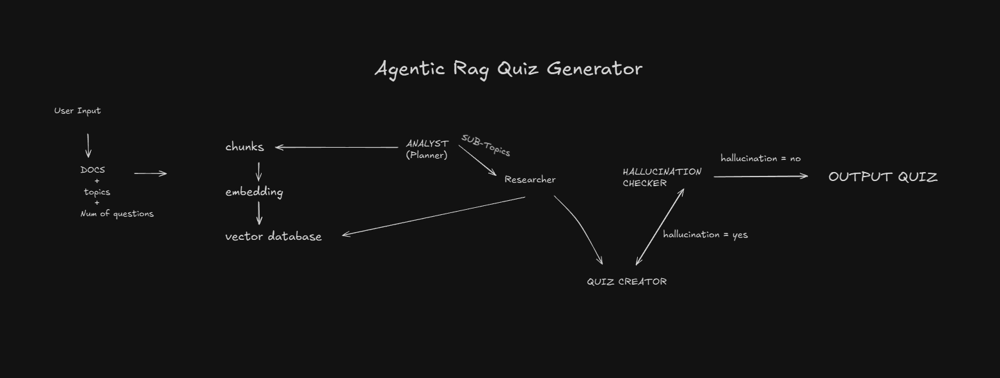

# 🚀 Agentic RAG Quiz Generator

An **Agentic Retrieval-Augmented Generation (RAG)** system that retrieves knowledge, reasons using multiple agents, and generates **context-aware quizzes** grounded in real data.

This project demonstrates a **production-style Agentic RAG architecture** using modern AI and full-stack technologies.

---

# Flowchart



## 🧠 Project Overview

Traditional RAG systems follow a single retrieve-then-generate approach.  
This project implements an **Agentic RAG pipeline**, where agents explicitly **plan, retrieve, reason, and generate**.

The system is built using **FastAPI, LangChain, LangGraph, ChromaDB, SQLite3**, and a modern **React + Vite + Tailwind CSS** frontend.

---

## 🏗️ System Architecture

**Flow:**

1. User interacts with the frontend UI
2. Request reaches the FastAPI backend
3. LangGraph orchestrates agents:
   - **Analyzer Agent** divides into sub topics
   - **Researcher Agent** fetches relevant context from ChromaDB using the sub topics
   - **Quiz Generator Agent** generates quiz questions using Gemini
   - **Hallucination Checker Agent** checks for hallucination and starts agentic loop
4. Quiz is returned to the UI and metadata is stored in SQLite3

---

## 🛠️ Tech Stack

**Backend**
- FastAPI
- LangChain
- LangGraph
- ChromaDB
- SQLite3
- Google Gemini API
- uv

**Frontend**
- React
- Vite
- Tailwind CSS

---

## ✨ Features

- Agent-based RAG architecture
- Multi-step reasoning using LangGraph
- Semantic retrieval via vector embeddings
- Clean and responsive UI
- Modular, extensible design

---

## ⚙️ Installation & Running the Project

### Pre-requisites
- Python 3.10+ (Python 3.14 may have issues)
- Node.js 18+
- git
- uv

---

### Step 1: Clone the repository
```bash
git clone https://github.com/JayTheCoder77/AgenticRagQuizGenerator.git
cd AgenticRagQuizGenerator
```

### Step 1.1 make a .env file in root
```bash
GEMINI_API_KEY=your_gemini_api_key
```

### Step 2: Install dependencies using uv
```bash
uv sync
uv run python -m backend.main

try uv add PyYAML -> uv sync 
if errors occur
```
(automatically syncs - may take time as libraries are downloaded)

### Step 3: frontend
In another terminal tab
```bash
cd frontend/
npm install
npm run dev
```

